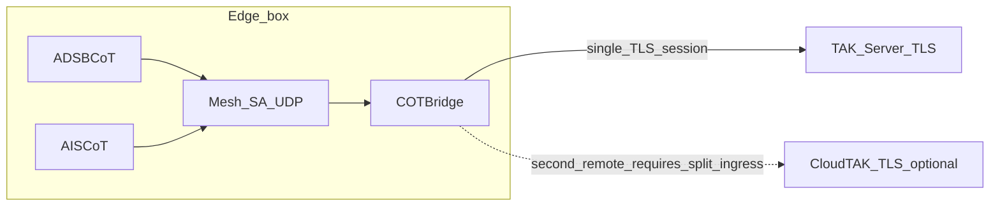

# COTBridge

**Repository:** [github.com/snstac/cotbridge](https://github.com/snstac/cotbridge)

```sh
git clone https://github.com/snstac/cotbridge.git
# or (SSH)
git clone git@github.com:snstac/cotbridge.git
```

COTBridge is a [PyTAK](https://github.com/snstac/pytak)-based **Cursor on Target (CoT) bridge**: it relays CoT traffic between heterogeneous TAK endpoints (different transports, subnets, or trust zones), similar in spirit to a cross-domain relay or guarded “lane” across a separation boundary.

**Important:** COTBridge is **software forwarding**. It is **not** a hardware data diode. For strict one-way policies use **forward-only lanes**, network segmentation, and operational controls.

## Architecture

COTBridge is typically deployed where edge gateways already emit Cursor on Target (CoT) on lightweight transports (for example UDP mesh), while upstream enrollment toward `TAKServer` stays centralized.

Without COTBridge, each upstream-facing gateway tends to carry **its own TLS client identity** toward `TAKServer`. With COTBridge on an “all-in-one” gateway box, ADSB-/AIS-style feeders remain **local CoT producers**, Mesh SA absorbs multicast fan-in, and **COTBridge** terminates mesh ingress and holds **one** outbound TLS session to `TAKServer`. That concentrates PKI / credential lifecycle at the bridge rather than duplicating it across every edge feeder.



The dashed edge marks **policy/configuration territory**, not an automatically dual-published TLS fan-out (see **Ingress fan-out limit** below).

### Ingress fan-out limit

Today **each enabled `[lane:*]`** calls PyTAK `protocol_factory` on ingress independently (`run_lane` in [`src/cotbridge/bridge.py`](src/cotbridge/bridge.py)). Two lanes configured with **the same multicast / UDP ingress** will contend on bind—configure **distinct ingress endpoints**, place an intermediate UDP broker (“pub/sub”), deploy multiple hosts, or track future support for **multi-egress from one ingress** (single reader plus multiple TLS sinks).

For **local UDP feeders** on a fixed port, listen with `udp://:18087` or `udp+ro://:18087` (all interfaces, same as `0.0.0.0`) or `udp+ro://127.0.0.1:18087` (loopback). Feeders send with `udp+wo://127.0.0.1:18087` (or the host IP). Do not use bare `udp://127.0.0.1:PORT` on loopback — use `udp+ro://` for listen or `tcp://` for outbound TCP feeders.

## Install

```sh
pip install .
# protobuf CoT payloads (optional, matches PyTAK):
pip install '.[with_takproto]'
```

## Configuration

INI file with optional global `[cotbridge]` and one or more `[lane:*]` sections. Each lane declares an **ingress** and **egress** PyTAK `COT_URL` pair and a **mode**:

| Mode     | Traffic                                        |
|---------|-------------------------------------------------|
| `forward` | Ingress → egress only                           |
| `reverse` | Egress → ingress only                         |
| `duplex`  | Both directions (ensure no feedback loops)   |

See [`examples/cotbridge.ini`](examples/cotbridge.ini). PyTAK URL schemes and TLS options follow [PyTAK configuration](https://pytak.rtfd.io/).

## CLI

```sh
cotbridge --config /etc/cotbridge.ini
```

Environment overrides (same as PyTAK-style tooling):

| Variable           | Purpose                          |
|--------------------|----------------------------------|
| `COTBRIDGE_CONFIG` | Default path if `--config` omitted |
| `DEBUG`           | Verbose logs when truthy           |

Logging goes to stderr; under **systemd** use `journalctl -u cotbridge`. On startup, each enabled lane logs its **ingress → egress** plan and connection steps (`setup`, `ingress connected`, `active`); enrollment `token=` values in `tak://` URLs are redacted in logs.

## systemd

- **Packaged installs**: `.deb` ships [`debian/cotbridge.service`](debian/cotbridge.service) under `/lib/systemd/system/` (`ExecStart=/usr/bin/cotbridge`), creates user/group `cotbridge`, and installs `/etc/default/cotbridge` plus `/etc/cotbridge.ini` from `/usr/share/cotbridge/cotbridge.ini.example` on first install (`cotbridge.service`, `/etc/default/cotbridge` paths mirror Debian conventions).

- **Manual / pip installs**: use [`systemd/cotbridge.service`](systemd/cotbridge.service) (expects **`ExecStart=/usr/bin/cotbridge`**; adjust `ExecStart=` if your `cotbridge` lives elsewhere—for example `~/.local/bin` after `pip install --user`). Optional defaults for `COTBRIDGE_CONFIG`: [`examples/cotbridge.default`](examples/cotbridge.default) → `/etc/default/cotbridge`.

```sh
sudo install -Dm644 systemd/cotbridge.service /etc/systemd/system/cotbridge.service
sudo install -Dm644 examples/cotbridge.ini /etc/cotbridge.ini
sudo install -Dm644 examples/cotbridge.default /etc/default/cotbridge
sudo systemctl daemon-reload
sudo systemctl enable --now cotbridge
```

## Cockpit UI

Minimal app in [`cockpit-cotbridge/`](cockpit-cotbridge/); see [`cockpit-cotbridge/README.md`](cockpit-cotbridge/README.md).

Install Cockpit itself separately (`cockpit` / `cockpit-ws` on your distro). The Python wheels **data-files** and Debian packages land assets under **`/usr/share/cockpit/cotbridge/`**. Developers without packaging may still run:

```sh
(cd cockpit-cotbridge && sudo make install)
```

Reload Cockpit to open **COTBridge** from the tools menu.

## DEB/RPM packaging

Pattern mirrors [`snstac/pytak`](https://github.com/snstac/pytak) and [`snstac/adsbcot`](https://github.com/snstac/adsbcot): root [`Makefile`](Makefile) coordinates [`stdeb`](https://pypi.org/project/stdeb/) (`setup.py` + [`stdeb.cfg`](stdeb.cfg)), [`debian/install_pkg_build_deps.sh`](debian/install_pkg_build_deps.sh) primes APT deps, and `python3 setup.py bdist_rpm` emits SPEC-derived RPMs (Fedora smoke CI).

```sh
sudo bash debian/install_pkg_build_deps.sh
make package                # produces deb_dist/*.deb (+ faux_latest/ duplicates)
```

**RPM on Fedora** (container-friendly):

```sh
dnf install -y git python3 rpm-build python3-setuptools
python3 setup.py bdist_rpm --python=/usr/bin/python3
```

RPM metadata declares `Requires: python3`; [`pyproject.toml`](pyproject.toml) also declares `pytak`. Confirm PyTAK is satisfied (`dnf install python3-pytak`, COPR, or `pip`) on your target fleet—upstream distro naming shifts occasionally.

GitHub Actions (`.github/workflows/ci.yml`) runs pytest on PR/push and attaches Debian/Fedora artifacts **when tagging**.

## Deployment

- **Docker / Compose**: [`deploy/docker/README.md`](deploy/docker/README.md) — image runs COTBridge plus Cockpit on port **9090** (`cockpit-ws --no-tls`; use a reverse proxy in production). Use Compose profile **`hostnet`** on Linux when bridging **multicast** CoT.
- **Ansible**: [`ansible/README.md`](ansible/README.md) — `cotbridge_deploy=docker` for the Compose stack, or **`native`** for cockpit + pip install on the host (better match for [AryaOS](https://github.com/snstac/aryaos)-style gateways).

## References

- [PyTAK](https://github.com/snstac/pytak/)
- Example ecosystem pattern: [ADSBCOT](https://github.com/snstac/adsbcot/) + [cockpit-adsbcot](https://github.com/snstac/cockpit-adsbcot/)

## The snstac TAK sensor ecosystem

Different sensor, same workflow — pick the gateway for your application; most have a
matching Cockpit plugin for browser-based management:

| Application | Gateway | Cockpit plugin |
|---|---|---|
| Aircraft via ADS-B (1090 MHz / 978 MHz UAT) | [adsbcot](https://github.com/snstac/adsbcot) | [cockpit-adsbcot](https://github.com/snstac/cockpit-adsbcot) |
| Ships & vessels via AIS | [aiscot](https://github.com/snstac/aiscot) | [cockpit-aiscot](https://github.com/snstac/cockpit-aiscot), [cockpit-aiscatcher](https://github.com/snstac/cockpit-aiscatcher) |
| Drone / UAS Remote ID (counter-UAS) | [dronecot](https://github.com/snstac/dronecot) | [cockpit-dronecot](https://github.com/snstac/cockpit-dronecot) |
| Own position via GPS/GNSS | [lincot](https://github.com/snstac/lincot) | [cockpit-lincot](https://github.com/snstac/cockpit-lincot), [cockpit-gps](https://github.com/snstac/cockpit-gps) |
| Radio direction finding (KrakenSDR) | [kraktak](https://github.com/snstac/kraktak) | — |
| APRS amateur radio | [aprscot](https://github.com/snstac/aprscot) | — |
| Weather stations | [windtak](https://github.com/snstac/windtak) | — |
| CoT routing / TAK Server bridging | [cotbridge](https://github.com/snstac/cotbridge) | — |

All gateways are built on [PyTAK](https://github.com/snstac/pytak), speak
**Cursor on Target (CoT)** to **ATAK, WinTAK, iTAK, TAK Server, and Mesh SA**, ship as
signed Debian/RPM packages at [snstac.github.io/packages](https://snstac.github.io/packages),
and come pre-installed on [AryaOS](https://github.com/snstac/aryaos), the
situational-awareness OS for Raspberry Pi.
