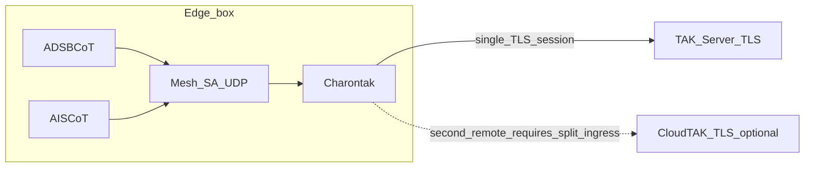

# Charontak

**Repository:** [github.com/snstac/charontak](https://github.com/snstac/charontak)

```sh
git clone https://github.com/snstac/charontak.git
# or (SSH)
git clone git@github.com:snstac/charontak.git
```

Charontak is a [PyTAK](https://github.com/snstac/pytak)-based **Cursor on Target (CoT) bridge**: it relays CoT traffic between heterogeneous TAK endpoints (different transports, subnets, or trust zones), similar in spirit to a cross-domain relay or guarded “lane” across a separation boundary.

**Important:** Charontak is **software forwarding**. It is **not** a hardware data diode. For strict one-way policies use **forward-only lanes**, network segmentation, and operational controls.

## Architecture

Charontak is typically deployed where edge gateways already emit Cursor on Target (CoT) on lightweight transports (for example UDP mesh), while upstream enrollment toward `TAKServer` stays centralized.

Without Charontak, each upstream-facing gateway tends to carry **its own TLS client identity** toward `TAKServer`. With Charontak on an “all-in-one” gateway box, ADSB-/AIS-style feeders remain **local CoT producers**, Mesh SA absorbs multicast fan-in, and **Charontak** terminates mesh ingress and holds **one** outbound TLS session to `TAKServer`. That concentrates PKI / credential lifecycle at the bridge rather than duplicating it across every edge feeder.



The dashed edge marks **policy/configuration territory**, not an automatically dual-published TLS fan-out (see **Ingress fan-out limit** below).

### Ingress fan-out limit

Today **each enabled `[lane:*]`** calls PyTAK `protocol_factory` on ingress independently (`run_lane` in [`charontak/bridge.py`](charontak/bridge.py)). Two lanes configured with **the same multicast / UDP ingress** will contend on bind—configure **distinct ingress endpoints**, place an intermediate UDP broker (“pub/sub”), deploy multiple hosts, or track future support for **multi-egress from one ingress** (single reader plus multiple TLS sinks).

## Install

```sh
pip install .
# protobuf CoT payloads (optional, matches PyTAK):
pip install '.[with_takproto]'
```

## Configuration

INI file with optional global `[charontak]` and one or more `[lane:*]` sections. Each lane declares an **ingress** and **egress** PyTAK `COT_URL` pair and a **mode**:

| Mode     | Traffic                                        |
|---------|-------------------------------------------------|
| `forward` | Ingress → egress only                           |
| `reverse` | Egress → ingress only                         |
| `duplex`  | Both directions (ensure no feedback loops)   |

See [`examples/charontak.ini`](examples/charontak.ini). PyTAK URL schemes and TLS options follow [PyTAK configuration](https://pytak.rtfd.io/).

## CLI

```sh
charontak --config /etc/charontak.ini
```

Environment overrides (same as PyTAK-style tooling):

| Variable           | Purpose                          |
|--------------------|----------------------------------|
| `CHARONTAK_CONFIG` | Default path if `--config` omitted |
| `DEBUG`           | Verbose logs when truthy           |

Logging goes to stderr; under **systemd** use `journalctl -u charontak`.

## systemd

- **Packaged installs**: `.deb` ships [`debian/charontak.service`](debian/charontak.service) under `/lib/systemd/system/` (`ExecStart=/usr/bin/charontak`), creates user/group `charontak`, and installs `/etc/default/charontak` plus `/etc/charontak.ini` from `/usr/share/charontak/charontak.ini.example` on first install (`charontak.service`, `/etc/default/charontak` paths mirror Debian conventions).

- **Manual / pip installs**: use [`systemd/charontak.service`](systemd/charontak.service) (expects **`ExecStart=/usr/bin/charontak`**; adjust `ExecStart=` if your `charontak` lives elsewhere—for example `~/.local/bin` after `pip install --user`). Optional defaults for `CHARONTAK_CONFIG`: [`examples/charontak.default`](examples/charontak.default) → `/etc/default/charontak`.

```sh
sudo install -Dm644 systemd/charontak.service /etc/systemd/system/charontak.service
sudo install -Dm644 examples/charontak.ini /etc/charontak.ini
sudo install -Dm644 examples/charontak.default /etc/default/charontak
sudo systemctl daemon-reload
sudo systemctl enable --now charontak
```

## Cockpit UI

Minimal app in [`cockpit-charontak/`](cockpit-charontak/); see [`cockpit-charontak/README.md`](cockpit-charontak/README.md).

Install Cockpit itself separately (`cockpit` / `cockpit-ws` on your distro). The Python wheels **data-files** and Debian packages land assets under **`/usr/share/cockpit/charontak/`**. Developers without packaging may still run:

```sh
(cd cockpit-charontak && sudo make install)
```

Reload Cockpit to open **Charontak** from the tools menu.

## DEB/RPM packaging

Pattern mirrors [`snstac/pytak`](https://github.com/snstac/pytak) and [`snstac/adsbcot`](https://github.com/snstac/adsbcot): root [`Makefile`](Makefile) coordinates [`stdeb`](https://pypi.org/project/stdeb/) (`setup.py` + [`stdeb.cfg`](stdeb.cfg)), [`debian/install_pkg_build_deps.sh`](debian/install_pkg_build_deps.sh) primes APT deps, and `python3 setup.py bdist_rpm` emits SPEC-derived RPMs (Fedora smoke CI).

```sh
sudo bash debian/install_pkg_build_deps.sh
make package                # produces deb_dist/*.deb (+ faux_latest/ duplicates)
```

**RPM on Fedora** (container-friendly):

```sh
dnf install -y git python3 rpm-build python3-setuptools
python3 setup.py bdist_rpm --python=/usr/bin/python3
```

RPM metadata declares `Requires: python3`; [`pyproject.toml`](pyproject.toml) also declares `pytak`. Confirm PyTAK is satisfied (`dnf install python3-pytak`, COPR, or `pip`) on your target fleet—upstream distro naming shifts occasionally.

GitHub Actions (`.github/workflows/ci.yml`) runs pytest on PR/push and attaches Debian/Fedora artifacts **when tagging**.

## Deployment

- **Docker / Compose**: [`deploy/docker/README.md`](deploy/docker/README.md) — image runs Charontak plus Cockpit on port **9090** (`cockpit-ws --no-tls`; use a reverse proxy in production). Use Compose profile **`hostnet`** on Linux when bridging **multicast** CoT.
- **Ansible**: [`ansible/README.md`](ansible/README.md) — `charontak_deploy=docker` for the Compose stack, or **`native`** for cockpit + pip install on the host (better match for [AryaOS](https://github.com/snstac/aryaos)-style gateways).

## References

- [PyTAK](https://github.com/snstac/pytak/)
- Example ecosystem pattern: [ADSBCOT](https://github.com/snstac/adsbcot/) + [cockpit-adsbcot](https://github.com/snstac/cockpit-adsbcot/)
